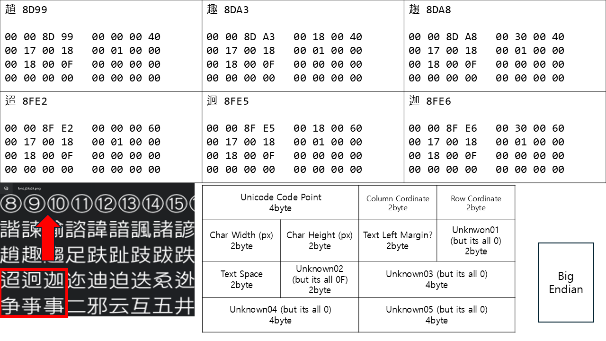

# ABF File

The abf file is a file that contains the Unicode code points, coordinates, and size information for each character in the font Atlas file.

I did this to analyze the font file of Nisekoi Yomeiri!? and analyzed only a part of the file.

# Header

The header was not analyzed, but hex editor can see the magic number, the name of the font used, and probably the name of the original atlas image (which is a dds file).

The Magic Number indicates that this file should be read in Big Endian.

# Body

The body begins with the string "BFNTCBLK" followed by an 8-byte value. The body consists of a list of thousands of 32-byte segments, which are listed until just before you meet the string "GENEEOF". Each segment contains information about one character and is a key target for this analysis.

## Structure of Body Segment

When I compared segments of several different characters to each other and found the difference, I found that it was made up of a photo-like structure.

There are 5 unknown areas with a size of 4 bytes; however, when we compared all the abf files, the last 3 areas were all 00 00 00 00.

# Simple Script

I created a simple Python script that analyzes the body segments, prints them, and marks the area of each character on the Atlas image. The deliverables are included in the repository.

Printed results will not be saved. Print with Pycharm, etc., copy and paste in a different text editor, then change to a fixed-width font for confirmation.

Printed results will not be saved. Print with Picham, etc., copy and paste in a different text editor, then change to a fixed-width font for confirmation.